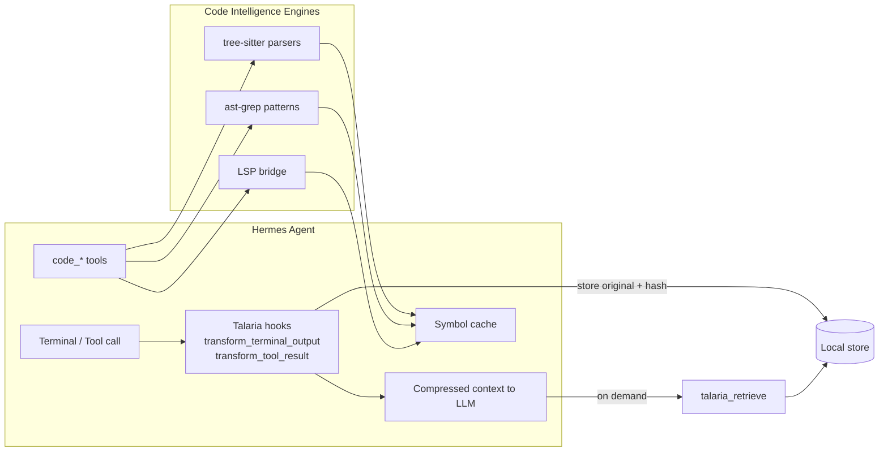

# hermes-talaria ⚡

[](https://github.com/Ce-daros/hermes-talaria/releases)
[](./LICENSE)
[](https://github.com/Ce-daros/hermes-talaria/commits/main)
[](https://github.com/NousResearch/hermes-agent)
[](https://www.python.org/)

> Compress the noise out of tool output and navigate code at AST speed.  
> `hermes-talaria` gives your agent winged sandals: less context bloat, faster code comprehension.

## What's inside

| Module | What it does |
|--------|--------------|
| **Talaria Compression** | Auto-compresses terminal & tool results via `headroom`, stores originals by hash, and lets the model retrieve them on demand. |
| **Native Code Intelligence** | tree-sitter + ast-grep + LSP bridge for symbols, definitions, references, diagnostics, refactor, and workspace summaries. |

## Compression benchmark

Tested on a VPS running the Hermes venv with the `cl100k_base` tokenizer.

| Scenario | Original tokens | Compressed tokens | Saved |
|---:|---:|---:|---:|
| Repeated error log (×500) | 15,499 | 1,864 | **88.0%** |
| Repetitive `ls -la` (×500) | 13,999 | 1,683 | **88.0%** |
| Repeated stack trace (×200) | 15,400 | 1,853 | **88.0%** |
| Repeated Rust warnings (×200) | 9,400 | 1,133 | **87.9%** |
| **Average** | **54,298** | **6,533** | **88.0%** |

Need the original back? Just call `talaria_retrieve` with the hash.

## Before / after

```text
# original: 500 identical error lines
2026-07-02T10:00:00.000Z api-service ERROR request_id=deadbeef connection timeout after 30s
2026-07-02T10:00:00.000Z api-service ERROR request_id=deadbeef connection timeout after 30s
... 498 more lines ...

# talaria compressed: ~88% smaller, hash attached
2026-07-02T10:00:00.000Z api-service ERROR request_id=deadbeef connection timeout after 30s
...[compressed]...
2026-07-02T10:00:00.000Z api-service ERROR request_id=deadbeef connection timeout after 30s
[talaria] {"hash": "a1b2c3d4...", "tokens_saved": 13635}
```

## Code intelligence benchmark

`code_symbols` on `__init__.py` (163 lines of Python):

- **14 symbols** extracted
- **23 ms** end-to-end
- Includes functions, variables, and signatures

## Architecture



## Tool inventory

### Talaria

| Tool | Purpose |
|------|---------|
| `talaria_compress` | Compress a large text block manually |
| `talaria_retrieve` | Fetch the original content behind a hash |
| `talaria_stats` | Show session compression stats |

### Code intelligence

| Tool | Purpose |
|------|---------|
| `code_symbols` | AST-powered symbol extraction |
| `code_search` | Structural pattern search with ast-grep |
| `code_definition` | Go to definition via LSP |
| `code_references` | Find references via LSP |
| `code_diagnostics` | Pull LSP diagnostics |
| `code_hover` | Hover info from LSP |
| `code_rename` | Rename symbol via LSP |
| `code_refactor` | Safe AST refactor |
| `code_callers` / `code_callees` | Call graph navigation |
| `code_capsule` | Symbol summarization |
| `code_workspace_summary` | Workspace-level overview |
| `code_impact` | Impact analysis |
| `code_tests_for_symbol` | Find tests related to a symbol |
| `code_query` | Code-aware structured query |
| `code_workspace_symbols` | Workspace-wide symbol search |
| `code_type_definition` | Type definition lookup |
| `code_signatures` | Signature help |
| `code_action` | LSP code actions |

## Quick start

### 1. Install dependencies

```bash
cd ~/.hermes/hermes-agent
source venv/bin/activate
pip install headroom-ai \
  tree-sitter tree-sitter-python tree-sitter-javascript tree-sitter-typescript \
  tree-sitter-rust tree-sitter-go tree-sitter-java \
  ast-grep-py
```

### 2. Copy the plugin

```bash
cp -r /path/to/hermes-talaria ~/.hermes/hermes-agent/plugins/hermes-talaria
```

### 3. Enable it

Edit `~/.hermes/config.yaml`:

```yaml
plugins:
  enabled:
    - hermes-talaria

platform_toolsets:
  cli:
    - hermes-cli
    - talaria
```

Restart Hermes.

### 4. Verify

In a Hermes session:

```text
/talaria status
```

You should see compression/retrieval stats.

## Usage examples

Compress a large blob manually:

```text
Use talaria_compress on the build log above.
```

Retrieve original lines:

```text
Use talaria_retrieve with hash=a1b2c3d4 and query="timeout".
```

Ask for symbols:

```text
Use code_symbols on src/main.py.
```

## Supported languages

- Python
- JavaScript / TypeScript / TSX
- Rust
- Go
- Java

C and C++ files are recognized; install a matching LSP server (e.g. `clangd`) for full navigation.

## License

MIT © Ame
