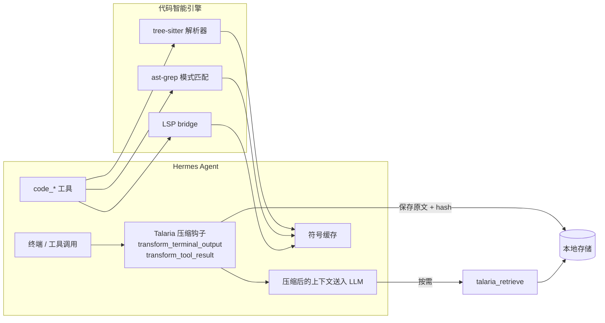

# hermes-talaria ⚡

[](https://github.com/Ce-daros/hermes-talaria/releases)
[](./LICENSE)
[](https://github.com/Ce-daros/hermes-talaria/commits/main)
[](https://github.com/NousResearch/hermes-agent)
[](https://www.python.org/)


> 压缩工具输出的噪音，用 AST 速度读懂代码。  
> `hermes-talaria` 给 Hermes Agent 装上飞鞋：上下文更少膨胀，代码理解更快。

## 这个插件是干嘛的

`hermes-talaria` 是 Hermes Agent 的插件，主要做两件事：

1. **Talaria 压缩层**：自动压缩终端和工具返回的大段输出，把原文按 hash 存起来，Agent 需要时再取回。
2. **原生代码智能**：用 tree-sitter、ast-grep 和 LSP 提供符号、定义、引用、诊断、重构、工作区摘要等能力。

一句话：**让上下文窗口少装垃圾，多装代码**。

## 压缩效果

在 VPS 的 Hermes venv 里，用 `cl100k_base` tokenizer 实测。

| 场景 | 原始 Token | 压缩后 Token | 节省 |
|---:|---:|---:|---:|
| 重复 error log（×500） | 15,499 | 1,864 | **88.0%** |
| 重复 `ls -la`（×500） | 13,999 | 1,683 | **88.0%** |
| 重复 stack trace（×200） | 15,400 | 1,853 | **88.0%** |
| 重复 Rust warnings（×200） | 9,400 | 1,133 | **87.9%** |
| **平均** | **54,298** | **6,533** | **88.0%** |

想取回原文？调用 `talaria_retrieve` 并传入 hash 就行。

## 压缩前后对比

```text
# 原始：500 行一模一样的错误日志
2026-07-02T10:00:00.000Z api-service ERROR request_id=deadbeef connection timeout after 30s
2026-07-02T10:00:00.000Z api-service ERROR request_id=deadbeef connection timeout after 30s
... 还有 498 行 ...

# Talaria 压缩后：体积缩小约 88%，并附带 hash
2026-07-02T10:00:00.000Z api-service ERROR request_id=deadbeef connection timeout after 30s
...[compressed]...
2026-07-02T10:00:00.000Z api-service ERROR request_id=deadbeef connection timeout after 30s
[talaria] {"hash": "a1b2c3d4...", "tokens_saved": 13635}
```

## 代码智能效果

对 `__init__.py`（163 行 Python）执行 `code_symbols`：

- 提取出 **14 个符号**
- 端到端耗时 **23 ms**
- 包含函数、变量与签名片段

## 架构



## 工具清单

### Talaria

| 工具 | 作用 |
|------|------|
| `talaria_compress` | 手动压缩一大段文本 |
| `talaria_retrieve` | 通过 hash 取回原始内容 |
| `talaria_stats` | 查看本会话的压缩统计 |

### 代码智能

| 工具 | 作用 |
|------|------|
| `code_symbols` | 基于 AST 的符号提取 |
| `code_search` | 使用 ast-grep 做结构化模式搜索 |
| `code_definition` | LSP 跳转到定义 |
| `code_references` | LSP 查找引用 |
| `code_diagnostics` | 获取 LSP 诊断 |
| `code_hover` | LSP hover 信息 |
| `code_rename` | LSP 重命名符号 |
| `code_refactor` | 安全的 AST 重构 |
| `code_callers` / `code_callees` | 调用图导航 |
| `code_capsule` | 符号摘要 |
| `code_workspace_summary` | 工作区级概览 |
| `code_impact` | 影响面分析 |
| `code_tests_for_symbol` | 查找与符号相关的测试 |
| `code_query` | 代码感知结构化查询 |
| `code_workspace_symbols` | 工作区范围符号搜索 |
| `code_type_definition` | 类型定义查找 |
| `code_signatures` | 签名帮助 |
| `code_action` | LSP code actions |

## 快速开始

### 1. 安装依赖

```bash
cd ~/.hermes/hermes-agent
source venv/bin/activate
pip install headroom-ai \
  tree-sitter tree-sitter-python tree-sitter-javascript tree-sitter-typescript \
  tree-sitter-rust tree-sitter-go tree-sitter-java \
  ast-grep-py
```

### 2. 复制插件

```bash
cp -r /path/to/hermes-talaria ~/.hermes/hermes-agent/plugins/hermes-talaria
```

### 3. 启用插件

编辑 `~/.hermes/config.yaml`：

```yaml
plugins:
  enabled:
    - hermes-talaria

platform_toolsets:
  cli:
    - hermes-cli
    - talaria
```

重启 Hermes。

### 4. 验证

在 Hermes 会话中：

```text
/talaria status
```

你应该能看到压缩与取回的统计。

## 使用示例

手动压缩一大段日志：

```text
Use talaria_compress on the build log above.
```

按关键词取回原始行：

```text
Use talaria_retrieve with hash=a1b2c3d4 and query="timeout".
```

提取文件符号：

```text
Use code_symbols on src/main.py.
```

## 支持语言

- Python
- JavaScript / TypeScript / TSX
- Rust
- Go
- Java

C / C++ 文件会被识别；安装对应的 LSP server（如 `clangd`）后可获得完整导航能力。

## 许可

MIT © Ame
